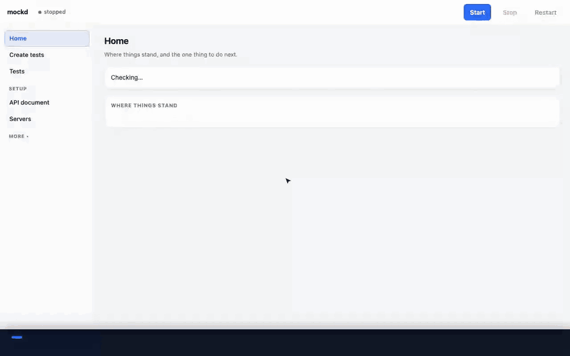
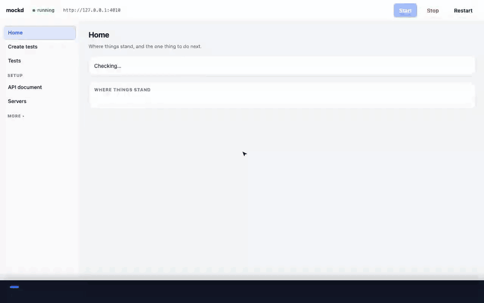

# mockd

Give it your API document and you get a working mock of the API, tests that
check every endpoint, and a way to run those same tests against dev or staging
— on your own machine, in minutes, with nothing to write first.

It is for the gap between "the API contract is agreed" and "the API is built
and correct": the UI team needs something to call today, QA needs tests before
there is anything to test, and everyone needs to know when the real API stops
matching what was agreed.



*3 min 43 s, against an API it had never seen — [download the video](docs/recordings/mockd-end-to-end.mp4)*

## What you get

- **A mock of your API.** Every endpoint answers in the documented shape, and a
  request in the wrong shape is refused the way the real API would refuse it.
  What you create you can read back, change and delete.
- **Tests nobody has to write.** A baseline is made from the document the
  moment the mock starts: each endpoint answers as documented, each resource
  can be created, read, changed and removed, bad input is refused, and an id
  that does not exist gets a 404.
- **The same tests on any server.** Add dev or staging once — name, address,
  how you sign in — and run there. A failure names what the API got wrong.
- **Your own tests, from a sentence.** Say what you want proven. An AI tool
  writes the test from your document; mockd checks it, saves it and runs it.
- **Bug reports in one press.** A failed test becomes a report with what was
  expected, what happened, and the request to re-run. No token in it.
- **One screen that says what to do next.** Home shows where things stand —
  document, mock, tests, servers — and the next step, with a button for it.

## What it supports

| | |
|---|---|
| **API documents** | OpenAPI 3.0 and 3.1, JSON or YAML — from a file, a URL, or the address of a Swagger page |
| **The mock** | request validation, create → read → update → delete with memory, documented 404 and 422, calls from a browser app on another port |
| **Servers** | the mock plus any number of your own; sign-in by token, cookie, or username and password; servers marked read only are never written to |
| **Tests** | single checks and multi-step flows; smoke, sanity, regression, negative and performance; priority P0–P3; owner, status and ticket links; grouped by module |
| **AI tools** | Claude Code, Claude Desktop and Cursor directly (MCP); any chat AI through a prompt to copy and paste; Claude or Codex on your machine. None is required |
| **Reports** | HTML to read or send, JUnit XML for CI, JSON for scripts, Markdown bug reports |
| **CI** | ready-made pipelines for GitHub Actions and GitLab |
| **Postman** | export the API as a collection; import an existing collection as tests |
| **Runs on** | macOS, Linux and Windows, with Python 3.9 or newer |

## Start

```bash
git clone https://github.com/abhijitjaiswal/mockd.git && cd mockd
python3 bootstrap.py          # Windows: python bootstrap.py
```

That builds a private environment in the folder, installs four dependencies
and opens the console at **http://127.0.0.1:4100**. Then:

1. **Add your API document** — paste a link or choose a file.
2. **Start the mock** — the baseline tests are made for you.
3. **Run the baseline** — then add a server and run it there.

A small sample API is included, so you can look around before adding your own.

## The screens

| | |
|---|---|
| **Home** | where things stand, and the one thing to do next |
| **Create tests** | a sentence in, tests out — validated, saved and tried |
| **Tests** | every test in one list: search, filter, pick a server, run, report |
| **API document** | which document is in use, and one box to bring in another |
| **Servers** | the mock and your servers; add one and test the connection |

Each opens on the simple thing. The technical tools are folded under
**Advanced** and **More**.

## Letting an AI tool do it (MCP)

Connect Claude Code, Claude Desktop or Cursor once, and ask it for tests in its
own window. It asks mockd which endpoints are involved, what they take and
return and where each id comes from; writes the tests; and saves and runs them
itself, correcting its own mistakes. **Create tests → Show me how** has the
exact text to paste. For Claude Code it is one command:

```bash
claude mcp add mockd -- /path/to/mockd/.venv/bin/python /path/to/mockd/mcp_server.py
```

mockd contains no AI and needs no key. The AI tool is never given a token or
password, can add tests but not change or remove them, and cannot write to a
read-only server.



*2 min 28 s — [download the video](docs/recordings/mockd-mcp.mp4). The
assistant's part is played by a script here; every call and answer is real.*

## From the command line

Everything the console does is a command, which is what CI runs.

```bash
python tests.py run --env mock --drafts                  # every test, on the mock
python tests.py run --env dev --priority P0 --junit report.xml
python verify.py --spec specs/your-api.json --env dev    # does the real API match the document?
python selftest.py                                       # mockd's own checks
```

## What it does not do

- **It does not know your business rules.** The mock returns the right shape
  and status, but it does not compute a total or track stock. Tests of such
  rules are settled on a real server, and the console says so.
- **JSON only.** XML, CSV and file uploads are not validated or mocked properly.
- **The mock forgets on restart.** Its data is held in memory.
- **Sign-in is not simulated in depth.** The mock can require a token to be
  present; it does not check scopes or roles.
- **No ticket-system integration yet.** Bug reports are Markdown to paste.
- **One machine.** It runs locally for one person; there is no hosted,
  multi-user version.

## More

- **[Reference](docs/reference.md)** — every command, option, file and limit
- **[Writing a good API document](SPEC_GUIDE.md)** — what makes a document
  mockable and testable
- **[How tests are organised](tests/README.md)**

## Licence

[Apache License 2.0](LICENSE). Use it, change it, ship it, sell it. If you
distribute something built on it, the [NOTICE](NOTICE) file must travel with it.
